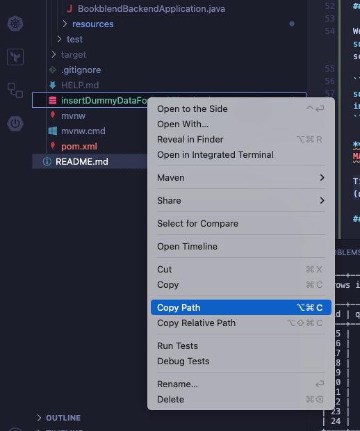
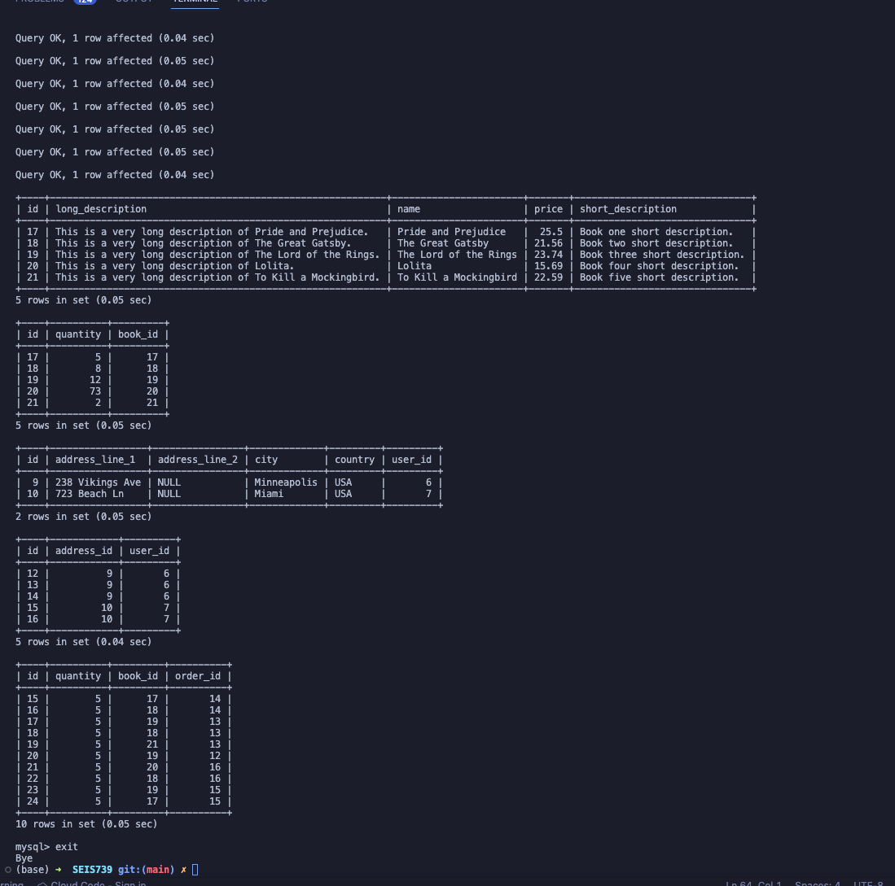

# SEIS739

## Full-stack application project

Website will have users who can buy an array or products in different quantities. It will hold the inventory of stock and allow users to make orders to ship to their address.

## What does our tech stack look like?

* Front-end: AngularJS
* Back-end: Spring
* Database engine: SQL server (created in Aiven similar to [this assignment](https://stthomas.instructure.com/courses/69116/files/8341755?module_item_id=2918632))

## `application.properties`

**IMPORTANT**: Replace the following contents in your local `bookblend-backend/src/main/resources/application.properties` BUT with the credentials to our database which I emailed you guys:

```
spring.application.name=bookblend-backend
management.endpoints.jmx.exposure.exclude=*

spring.jpa.hibernate.ddl-auto=update
spring.datasource.url=XXXXX
spring.datasource.username=XXXXX
spring.datasource.password=XXXXX
spring.datasource.driver-class-name=com.mysql.cj.jdbc.Driver

# Encryption configuration
encryption.salt.rounds=10

# JWT configuration
jwt.algorithm.key=SuperSecureSecretKey
jwt.issuer=eCommerce
jwt.expiryInSeconds=604800
```

## Run Application

To run our application, `cd` into `bookblend-backend`, and run the following command:

`./mvnw spring-boot:run`

## Connecting to Our Database via CLI

### Setup CLI

After installing `mysql` :

`brew install mysql`

### Connection

You can connect to our database in your terminal with the following command:

```terminal
mysql --user XXXXX --password=XXXXX --host XXXXX --port 14068 defaultdb
```

[Here](https://aiven.io/docs/products/mysql/howto/connect-from-cli) are the docs if you're having trouble.

### Setup Postgres Database

We have a script in the root of our source code, `insertDummyDataForBookBlend.sql`, that once you're connected to the database via cli, you can run the script on your local maching with the following command:

```terminal
source /Users/apafko/gradSchool/SEIS-739/SEIS739/bookblend-backend/insertDummyDataForBookBlend.sql
```

**⬆️ REPLACE THE FULL PATH WITH WHERE EVER THE SCRIPT IS LOCATED ON YOUR MACHINE ⬆️**

Tip: If you right-click on the file in the left-hand side window in VS Code (or whatever code editor you use), and click `Copy Path`, you can easily replace the full path in the `source` query above.



If you successfully conncected to the DB and run the script from your local machine, it should look something like:



## MISC

* Added Spring boot security to our app
* Temporarily put an endpoint for users to login and receive a JWT
* Have endpoint for all of the products available
* Have endpoint for all of the orders for the  user signed in

* Added initial code , test controller, exposed the mappings actuator functionality inside spring boot following this tutorial: https://www.youtube.com/watch?v=S7nVCB1Fqvk&list=PLtBt-olBU9cTm-5SdTy3mjaSEnHglK-Mz 